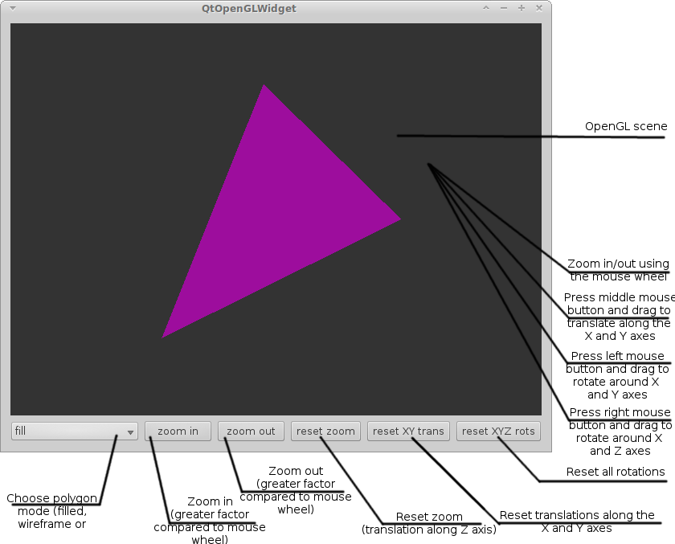

QtOpenGLWidget offers a start-up project for further development of 
applications that use the QGLWidget, part of the Qt framework. I use this for my 
terrain generator application (currently under development). I decide to separate 
the OpenGL widget's basic functionalities that I have implemented so that others 
can use it without the overhead of the rest of my application.

The widget consists of a top-level widget that also includes some controls and 
an embedded QGLWidget for viewing a 3D scene.

The project offers following features:

* OpenGL integration
* Basic navigation inside the OpenGL scene using a combination of Qt mouse 
event for rotation, translation and zooming
* Basic navigation and control outside the widget using buttons and a combobox

You can edit the project file to build either the shared library or the application. It consists of two major parts:

* OpenGLContainer - inherits directly from `QGLWidget` and `QGLFunctions` (the second one is optional though if not 
used you will be greatly restricted to what OpenGL you can create and display). This component is the major part of this 
project and contains all the functionality that you require in order to integrate OpenGL in your Qt application including 
various slots and signals that allow other components of your application to interact with it
* QtOpenGlWidget - this is more of a demo and shows an example of how components that are not part of `OpenGLContainer` widget 
can interact with it. This whole part is completely optional and you can remove it without reducing the functionality of the 
embedded widget mentioned above.

